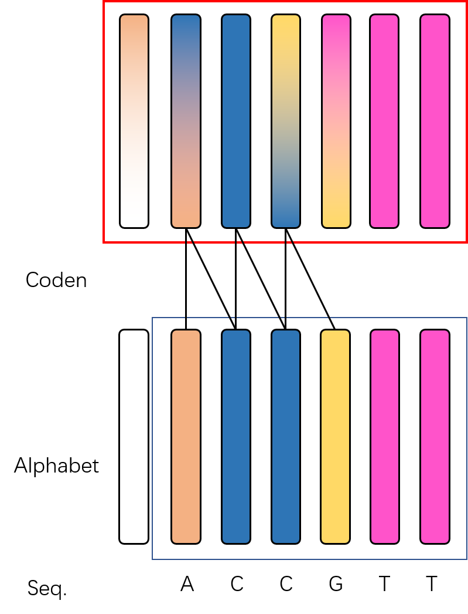

# R-ESM
Evolutionary Scale Modeling (ESM) for RNA

Built based on [ESM](https://github.com/facebookresearch/esm) (A Transformer protein language models from Facebook AI Research).

## Usage
```shell
pip install torch
pip install fair-esm
./exp.sh 
```
## Features
Training script for ESM
RNA codens as tokens


## TODO
-[x] build RNA dataset
